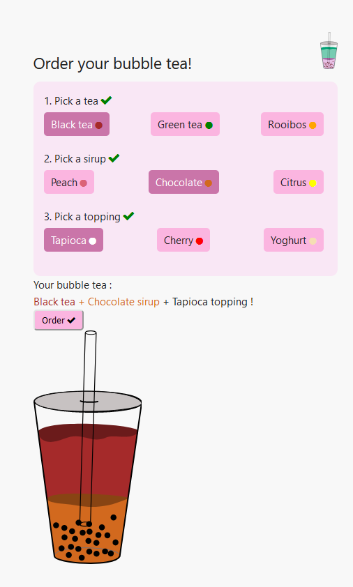

# Order your bubble tea 🥤

## A project with Vue.js and svg

 

Have you ever drank bubble teas? If yes, you know they can be customized. If no,  it's a cold beverage where you can customize almost anything.

I wanted to make a small project with Vue.JS, and be able to change the image depending on the selected flavour. I created the svg myself by the way, using Inskcape over a sketch I made.

Inspirations for this project are : Adibu, Candy Crush.

 


## Some instructions to reproduce this project

This template should help get you started developing with Vue 3 in Vite.

## Recommended IDE Setup

[VSCode](https://code.visualstudio.com/) + [Volar](https://marketplace.visualstudio.com/items?itemName=Vue.volar) (and disable Vetur) + [TypeScript Vue Plugin (Volar)](https://marketplace.visualstudio.com/items?itemName=Vue.vscode-typescript-vue-plugin).

## Customize configuration

See [Vite Configuration Reference](https://vitejs.dev/config/).

## Project Setup

```sh
npm install
```

### Compile and Hot-Reload for Development

```sh
npm run dev
```

### Compile and Minify for Production

```sh
npm run build
```
